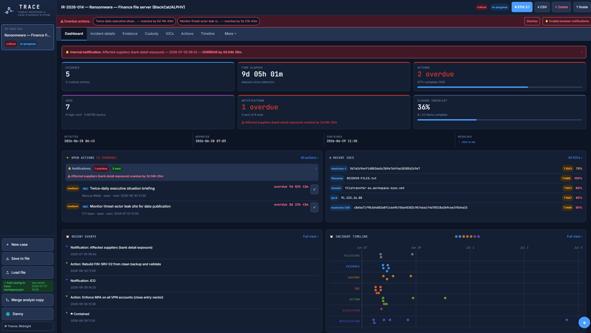

# TRACE — Threat Response & Case Evidence System

A single-file, offline-first incident response case management system for DFIR. Everything runs in your browser — no server, no install, no data leaving your machine.

TRACE helps incident responders manage the full lifecycle of a security incident: evidence and chain of custody, indicators of compromise with MITRE ATT&CK tagging, response actions, regulatory notifications, an accurate incident timeline, and structured closure — all aligned to the NIST incident response lifecycle.

---

## Contents

- [Why TRACE](#why-trace)
- [Quick start](#quick-start)
- [Sample cases](#sample-cases)
- [Feature overview](#feature-overview)
- [Data & privacy](#data--privacy)
- [Saving your work](#saving-your-work)
- [Working as a team](#working-as-a-team)
- [Exports & integrations](#exports--integrations)
- [TRACE Brief — post-incident briefing](#trace-brief--post-incident-briefing)
- [Themes](#themes)
- [Browser support](#browser-support)
- [File structure](#file-structure)
- [FAQ](#faq)
- [What's new](#whats-new)
- [Disclaimer](#disclaimer)

---

## Why TRACE

Most incident response tooling is either a heavyweight platform that needs infrastructure and onboarding, or a scattering of spreadsheets and documents that fall out of sync. TRACE sits in between: a single HTML file you can drop onto a workstation, an air-gapped analysis box, or a USB stick, and start logging an incident in seconds.

Because it is one self-contained file with no back end, it is well suited to:

- Sensitive incidents where data must not leave the local machine
- Air-gapped or restricted forensic environments
- Tabletop exercises and training
- Small teams who want structure without standing up a platform

It captures the artefacts that matter for a defensible investigation — evidence integrity hashes, chain of custody, IOC provenance, notification deadlines, and analyst attribution — and lets you export them in the formats downstream tools expect.

---

## Quick start

1. **Download** `TRACE-CMS.html`.
2. **Open it** in a modern browser (Chrome or Edge recommended — see [Browser support](#browser-support)).
3. Click **New case** and complete the short intake wizard, **or** load a [sample case](#sample-cases) to explore a fully worked example.
4. Click **? Guide** (top right) at any time for an in-app walkthrough.

That's it. There is nothing to install and no account to create.

Once an incident is closed, open **`trace-brief.html`** and load the same case file to generate the post-incident briefing visuals — see [TRACE Brief](#trace-brief--post-incident-briefing).

> **Tip:** For the safest setup, at the start of each incident click **Connect workspace** to link a file on disk (continuous auto-save) and **Set name** to enable analyst attribution. See [Saving your work](#saving-your-work).

---

## Sample cases

Two fully worked example cases are included. They are deliberately different in shape, so between them they exercise every feature of the system — useful for evaluating TRACE and for training.

**To load one:** open TRACE, click **Load file** in the sidebar, and select the `.json` file. Loading **merges** the case alongside anything you already have — it will not overwrite your existing work. Both samples use distinct case IDs, so you can load them together and switch between them in the sidebar.

### 1. Ransomware — `trace-sample-case.json`

**`IR-2026-014` — Akira ransomware on a finance file server.** Critical severity, still in progress. A fast, loud incident: initial access via a contractor VPN account with no MFA, discovery and credential harvesting, ~340GB exfiltrated, then encryption.

- **13 IOCs** spanning **7 ATT&CK tactics** — initial access, discovery, credential access, persistence, C2, exfiltration and impact
- IOCs aligned to genuine Akira tradecraft documented in CISA advisory **AA24-109A**: the `itadm` persistence account, Rclone exfiltration, AnyDesk for remote access, `akira_readme.txt` ransom notes, the `.akira` extension, and shadow-copy deletion
- **5 evidence items** with SHA-256 hashes and **4 chain-of-custody entries** (acquire → transfer → analyse)
- **6 response actions**, two of them recurring (twice-daily executive briefing, daily leak-site monitoring) with completed instances logged
- **6 notifications** — five sent, one pending — across regulator, internal, legal and insurance obligations
- A severity escalation, three root causes with remediations, and a partially complete closure checklist

Good for seeing the tool under pressure: overdue notifications, open actions, live dwell-time metrics.

### 2. Business email compromise — `trace-sample-case-bec.json`

**`IR-2026-009` — supplier payment diversion.** High severity, **closed**. A slow-burn financial fraud: a mailbox compromised via session-token phishing, ~16 days of quiet persistence behind a hiding inbox rule, then a fraudulent bank-detail change and an £84,500 payment — of which £61,200 was recalled.

- **9 IOCs** covering IOC types the ransomware case doesn't use — email, URL, IPv6, user-agent and custom `other` types (an inbox rule, an OAuth app ID)
- **10 actions**, **6 evidence items**, **6 custody entries**, **4 root causes** across technical, process and people categories
- **Two escalations including a de-escalation**, so the severity log shows movement in both directions
- **A fully completed closure checklist (22/22)** and a **complete lessons-learned section** — session details, what went well and badly, detection and playbook improvements, and five numbered recommendations
- A documented decision *not* to notify the ICO under Art. 33(1), with the reasoning retained — a realistic judgement call rather than a straightforward notification

Good for seeing a completed case end-to-end: the resolution metrics, the full report with lessons and recommendations, and closure.

---

## Feature overview

TRACE is organised into tabs, aligned to the phases of an incident.

**Dashboard** — an at-a-glance view of the active case: key metrics (evidence, time elapsed, actions, IOCs, notifications, closure progress), a clickable timestamp strip for setting detection/report/containment/resolution times, open action and notification summaries, recent activity, and a mini incident timeline.

**Incident details** — core incident metadata, narrative, affected systems, and severity/status.

**Evidence** — the evidence register. Log each item with type, integrity hash, source, and who collected it and when. Filterable.

**Custody** — chain-of-custody entries linked to evidence items, recording each handling event (acquired, transferred, analysed, returned) for a defensible audit trail.

**IOCs** — indicators of compromise with inline **MITRE ATT&CK** technique lookup (search by what you observed — e.g. "powershell", "lsass", "scheduled task" — no need to remember every ATT&CK technique ID). Each IOC records an **observed-at** time so the timeline reflects reality. View as a flat list or grouped **by host**, and filter by value, type, host, MITRE ID or notes.

Indicators are **defanged automatically** wherever a human reads them, and adding one that already exists on the same host prompts a duplicate warning — while the same indicator on a different host is kept as a distinct sighting.

**Actions** — response tasks with owner, priority, due date, and status. Supports **recurring** actions (e.g. twice-daily briefings) with per-instance completion tracking.

**Timeline** — a unified incident timeline combining evidence, custody, IOCs, actions, escalations, notifications, and phase milestones (detected/reported/contained/resolved). Filter by type; switch between list and visual views.

**Reports** — the reporting and export hub. See [Exports & integrations](#exports--integrations).

**More** menu — governance context, severity log, notifications tracker, closure checklist, and an IR reference.

### Governance & compliance

- **Notifications tracker** with deadline calculation from detection time, distinguishing regulatory obligations (ICO/UK GDPR, NIS2, DORA, and others) from internal and advisory notifications, with sent/pending status
- **Closure checklist** covering containment, evidence, IOCs, recovery, actions, and notifications
- NIST incident response lifecycle alignment surfaced throughout

### Data integrity

Deleting a record always asks for confirmation and names what's being removed. Deleting an evidence item that has chain-of-custody entries attached warns you and removes those entries too, so the custody record never contains orphaned references to evidence that no longer exists.

---

## Data & privacy

TRACE runs **entirely in your browser**. There is no server and no telemetry — nothing you enter is transmitted anywhere. Your data lives in two places:

1. **Browser storage** — TRACE automatically mirrors your work to local browser storage on every change, so an accidental tab close or crash will not lose data.
2. **A workspace file** (optional but recommended) — a real `.json` file on your disk that TRACE keeps continuously up to date. See below.

---

## Saving your work

There are two ways to persist a case, and they serve different purposes.

### Connect workspace (recommended)

Links TRACE to a `.json` file on your computer and **auto-saves to it on every change**. Within a second or two of any edit, the file on disk is current — so a crash or reboot costs you nothing.

- Click **Connect workspace** → **Create new** to choose a location and filename, or **Open existing** to resume auto-saving into a file you made earlier.
- A green indicator confirms "Auto-saving to *[file]*" once connected.
- After a full browser restart, click **Connect → Open** once to re-link the file (browsers drop the file handle when closed). Between launches you remain protected by browser storage.

The workspace file stores your **entire workspace**, not just the active case — every open case, plus which case and tab you were last on. Reconnecting after a crash restores all of it exactly as you left it.

### Save to file

A one-time snapshot export you trigger manually — useful for handing someone a copy, archiving a point-in-time state, or moving a case between machines.

**In short:** use **Connect workspace** for day-to-day durability; use **Save to file** for snapshots and sharing.

> **Note on workspace auto-save:** The **Connect workspace** feature — which links TRACE to a file on your disk and saves to it automatically on every change — relies on the browser's file system API, which is currently only supported in **Chromium-based browsers (Google Chrome, Microsoft Edge, Opera, Brave)**. In Firefox and Safari this option is hidden, but TRACE still works fully: your data is saved to browser storage automatically, and you can persist cases manually using **Save to file** and reload them with **Load file**. For the most durable setup, use Chrome or Edge.

---

## Working as a team

TRACE supports multi-analyst incidents without needing a shared server.

### Analyst identity

Click **Set name** to record your name and pick an avatar colour. Every record you add — evidence, IOCs, actions, custody — is **stamped** with who added it and when, so on a shared case you can see who logged what.

### Merge analyst copy

For team incidents where analysts can't all edit the same file live, each analyst works on their own copy of a case. One person then clicks **Merge analyst copy** and selects a colleague's file. TRACE **combines** the two copies of the case intelligently:

- New evidence, IOCs, actions, and other records from their copy are **added** to yours
- Where both analysts edited the same record, the **most recently edited version wins**
- Completed recurring tasks, closure checklist items, and "notification sent" flags are **combined** — if either analyst did it, it counts

Nothing is ever overwritten destructively; everyone's work is preserved. The merge is safe to run repeatedly (it will not create duplicates) and accumulates correctly across multiple analysts. You receive a summary of what was added and updated.

---

## Exports & integrations

All exports live together in the **Reports** tab, each showing what it will contain before you generate it.

| Export | Format | Use |
|---|---|---|
| **Incident report** | PDF / HTML | A formatted report for stakeholders. Choose exactly which sections to include; preview before generating |
| **CSV** | Single spreadsheet | All artefacts (evidence, custody, IOCs, actions, escalations, notifications, root causes) flattened into one file |
| **STIX 2.1** | JSON bundle | Share indicators with threat-intel platforms, MISP, or partner organisations |
| **ATT&CK Navigator** | Navigator layer JSON | Visualise tagged techniques on the MITRE ATT&CK matrix |
| **JSON** | TRACE workspace | Full-fidelity backup, sharing, and the basis for the merge workflow |

The CSV export uses proper quoting/escaping and a UTF-8 byte-order mark so it opens cleanly in Excel. STIX and Navigator exports use standard STIX tactic shortnames so techniques land in the correct columns, and are pinned to the current ATT&CK version.

**A note on defanging:** IOC values are defanged in the incident report and CSV, since those are read and shared by people. **STIX exports keep raw, live values** — a defanged pattern would be invalid and would fail to match in any downstream platform. If you use the CSV as an import path into tooling, re-fang the values first.

---

## TRACE Brief — post-incident briefing

Working an incident and explaining one are different jobs. TRACE is built for the first: capturing evidence, indicators and decisions accurately while the response is live. **TRACE Brief** is built for the second — turning that finished record into something you can put in front of an executive, a board, a client, a regulator or a lessons-learned session.

It is a separate single HTML file, **`trace-brief.html`**, that runs the same way: open it, drop in a case `.json` you saved from TRACE, and it builds the briefing. Nothing is uploaded, and it never writes back to your case — it only reads.

**Why it exists.** The question after an incident is rarely "what were the indicators". It's *how long were they in, how did they get in, what did they touch, and how fast did we react*. Those answers exist in the case data but not in a form anyone outside the response team can absorb. Brief derives them and presents them visually.

### The six views

They are ordered as a briefing runs — bottom line first, then how it unfolded, step by step, where it spread, what was used — and numbered so they can be walked through in sequence. Each view links on to the next.

**1. Executive summary** — the one-page answer, structured BLUF. A single block above the fold carries the incident title, an auto-composed verdict (*"Critical severity Ransomware affecting FIN-SRV-02. Contained within 4h 38m of detection. The incident remains open."*), the four figures that matter — estimated cost, attacker dwell time, time to contain, systems affected — and a status row answering whether the threat is contained, the incident resolved, notifications discharged and actions closed. Below that: business impact drawn from the governance record, the narrative in brief with a plain-English judgement on detection speed, root causes each paired with its remediation, everything still outstanding, and who ran the response. This is the page you print and hand over.

**2. Key facts** — the metrics view. A headline figure, a response clock comparing time to report, contain and resolve, ranked tactic activity, the incident flow with elapsed time between each phase, and metric tiles for indicators, hosts, evidence, actions and notifications.

**3. Attack progression** — the observed ATT&CK tactics laid out along a kill-chain spine in true order, each stage sized by how many indicators support it. This is the "how did this unfold" slide: initial access through to impact, readable at a glance, with the indicators for each stage listed underneath.

**4. IOC timeline** — every indicator across every host in chronological order, one per row, with the elapsed gap between each. Response milestones (detected, contained, resolved) are interleaved in position, so it's immediately visible which indicators pre-date detection and which were found during the response. Each entry carries its timestamp, tactic, technique, host, confidence and the analyst's notes — so the sequence reads as a narrative you can walk a room through, step by step.

**5. Host swimlanes** — one lane per system, with threads connecting indicators in observed order. This is the lateral-movement picture: where the attacker started, where they went, and when. Hosts can be shown or hidden individually to focus on a particular system.

**6. Techniques** — coverage across all 14 ATT&CK Enterprise tactics, showing which stages were observed and which were not. The gaps are often as informative as the hits. Technique IDs link out to the MITRE knowledge base.

### Practical notes

- **Derived, not re-entered.** Dwell time is computed from the earliest observed indicator to the detection timestamp, so it reflects the evidence rather than an estimate. All timings come from the case data.
- **Defanged throughout**, matching TRACE — safe to project, screenshot or circulate.
- **Print to PDF** from any view; the interface controls drop away and the visuals print clean.
- **Multiple cases in one file** are handled: you'll be asked which to open.
- **Honest about gaps.** Indicators without an observed-at time fall back to when they were logged, but are flagged as such rather than silently presented as fact. Indicators with no timestamp at all are reported as omitted rather than dropped quietly.
- **Read-only.** It cannot alter your case, so it is safe to hand to someone outside the response team.

---

## Themes

Both TRACE and TRACE Brief cycle the **Theme** button through the same three options; your choice is remembered per tool:

- **Midnight** *(default)* — dark navy security-console aesthetic
- **Daybreak** — a warm, muted light theme (parchment, heritage green/amber/blue)
- **Console** — a green-on-black terminal look

---

## Browser support

TRACE works in any modern browser, but a few features rely on the **File System Access API**:

- **Connect workspace** (continuous auto-save to a disk file) requires a **Chromium-based browser** (Chrome or Edge).
- In browsers without this API (e.g. Firefox, Safari), TRACE still works fully — it falls back to browser storage plus manual **Save to file** / **Load file**. The **Connect workspace** option is hidden where unsupported.

Everything else — all tabs, exports, themes, merge, the sample cases, and all of TRACE Brief — works everywhere.

---

## File structure

| File | Description |
|---|---|
| `TRACE-CMS.html` | The main application — a single self-contained HTML file. This is all you need to run TRACE. |
| `trace-brief.html` | The briefing companion — turns a saved case into management-facing visuals. Optional. |
| `trace-sample-case.json` | Sample case 1 — Akira ransomware, critical, in progress. |
| `trace-sample-case-bec.json` | Sample case 2 — business email compromise, high, closed with full lessons learned. |
| `docs/trace-dashboard.PNG` | Dashboard preview image used in this README. |
| `README.md` | This guide. |

The application is a single file with no build step and no external dependencies beyond a web font loaded from Google Fonts (it degrades gracefully to system fonts offline).

---

## FAQ

**Do I need to install anything or run a server?**
No. Open `TRACE-CMS.html` in a browser and you're running.

**Is my data sent anywhere?**
No. Everything stays in your browser and, if you connect a workspace, in a file on your own disk.

**Will loading a sample case overwrite my work?**
No — loading and merging combine cases; they never destructively replace your existing cases. You can load both samples at once.

**If my browser crashes with several cases open, do I get them all back?**
Yes. The workspace file holds your entire workspace, including every open case and which one you were viewing. Reconnect the file and you're back where you were.

**Can several people work on one incident?**
Yes. Each analyst keeps their own copy and one person merges the others in with **Merge analyst copy**. Records are attributed to whoever added them.

**What happens to my workspace connection after I close the browser?**
Browser storage keeps your data safe between launches. To resume live auto-save to your disk file, click **Connect → Open** once after restarting.

**What's the difference between the incident report and TRACE Brief?**
The report is the formal written record — narrative, tables, sections you choose, suitable for a case file or a regulator. Brief is the visual explanation — kill chain, timeline, infographic — for briefing people who weren't in the response. Most incidents warrant both.

**Does TRACE Brief change my case data?**
No. It only reads the file you give it. You can hand it to someone outside the response team without any risk to the record.

**Why are IOCs shown with brackets in them?**
That's defanging — it stops live indicators being clicked accidentally or detonated by a mail gateway when a report is shared. STIX exports keep the real values.

**Which browser should I use?**
Chrome or Edge for the full experience (including workspace auto-save). Others work with manual save/load.

---

## What's new

### TRACE Brief — a companion briefing tool

A second single-file tool, **`trace-brief.html`**, turns a finished case into something you can put in front of a management audience. Drop in the same `.json` you already save from TRACE and it builds it builds six briefing views, opening with an executive summary and ordered as a briefing runs: a key-facts infographic, an attack progression along the ATT&CK kill chain, a full chronological IOC timeline with narrative, host swimlanes and a technique breakdown. Same offline model, same three themes. See [TRACE Brief](#trace-brief--post-incident-briefing).

### Reporting & exports

- **Dedicated Reports tab.** Reporting is now a first-class section on the main menu bar rather than being buried in a submenu. All four export types — incident report, CSV, STIX 2.1 and ATT&CK Navigator — sit together as cards showing what each one contains (`13 indicators`, `38 records`, and so on).
- **Choose what goes in the report.** Pick exactly which sections to include; the header summary, key timestamps, governance snapshot and incident narrative are always present. Section numbering renumbers itself so there are never gaps. A live preview updates as you change the selection.
- **Readable in every theme.** The report preview renders on white regardless of whether you're in Midnight, Daybreak or Console.

### IOC handling

- **Automatic defanging.** Live indicators are neutralised wherever a human reads them — in the app, the incident report and the CSV export (`185[.]220[.]101[.]47`, `hxxps://`). Hashes, filenames and account names are left alone. STIX exports keep raw values, since they must stay machine-parseable.
- **Host-aware duplicate detection.** Adding an indicator already logged *on the same host* prompts a warning. The same indicator on a *different* host is kept, because that's a distinct and forensically meaningful sighting.
- **Search and filter.** Filter IOCs and evidence by value, type, host, MITRE ID or notes, with a live match count.
- **Observed-at times.** Each IOC records when it was *seen*, separate from when it was logged, so the timeline reflects reality rather than data-entry order.
- **View by host.** Group indicators by the system they were seen on, sorted earliest-first for a per-host mini-timeline.
- **Full 14-tactic ATT&CK coverage**, including Reconnaissance and Resource Development, with exports pinned to the current ATT&CK version.

### Data integrity

- **Delete confirmation** on every record, naming what's about to be removed.
- **No orphaned custody records.** Deleting an evidence item that has chain-of-custody entries attached warns you and removes those entries too, so the custody chain never references evidence that no longer exists.

### Interface

- **Three themes** — Midnight (dark navy, default), Daybreak (warm parchment) and Console (terminal green).
- **Incident milestones on the timeline.** Detected, reported, contained and resolved appear as timeline events, so containment — the dwell-time boundary — is visible where it matters.
- **Editable timestamps from the dashboard.** Click any entry in the timestamp strip to set or change it inline.
- **Two sample cases** to load and explore (see below).

---

## Disclaimer

TRACE is a case-management and record-keeping aid, and TRACE Brief is a presentation aid for the data it holds. It does not provide legal advice. Regulatory notification deadlines and obligations shown in the tool are aids to tracking and must be verified against the applicable regulations and your organisation's legal counsel for any real incident. You are responsible for the security and handling of the case data you enter and export.

### No warranty & data-loss disclaimer

TRACE is provided **"as is", without warranty of any kind**, express or implied, including but not limited to warranties of merchantability, fitness for a particular purpose, and non-infringement. You use it entirely at your own risk.

Because TRACE stores data in your browser and in local files that **you** are responsible for managing, **the authors and contributors accept no liability for any loss, corruption, or inaccessibility of your data** — however it occurs, including (but not limited to) browser storage being cleared, a lost or overwritten workspace file, a browser or system crash, an unsaved session, a failed import or merge, or user error. There is no server-side backup and no way for anyone to recover data on your behalf.

**You are solely responsible for backing up your case data.** Export regularly using **Save to file**, keep copies of your workspace `.json` files in secure, backed-up storage, and do not rely on browser storage as your only copy. In no event shall the authors or contributors be liable for any direct, indirect, incidental, or consequential damages arising from the use of this software or the loss of any data created with it.

---

## Usage & distribution

TRACE and TRACE Brief are free to use and free to share. You may download, use, copy, and distribute it at no charge, including within your organisation and to others, provided it remains **free of charge** and this notice and the accompanying disclaimers are kept intact. You may **not sell, resell, license for a fee, or otherwise commercialise** either tool, or any substantially unmodified version of them, whether on its own or bundled as part of a paid product or service. If you share it, share it freely.
