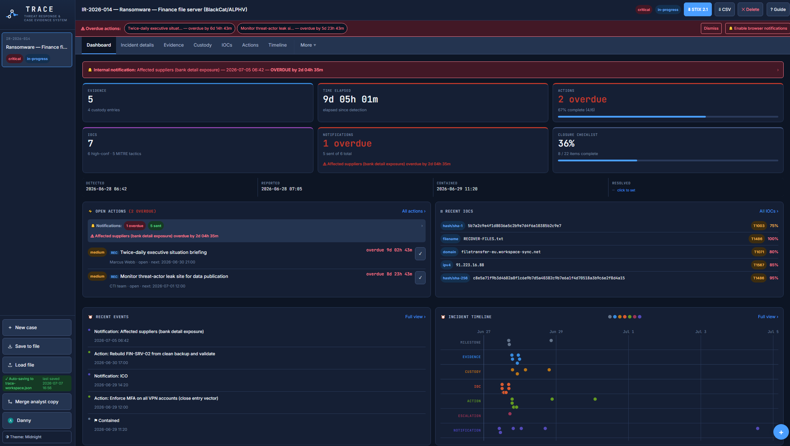

# TRACE — Threat Response & Case Evidence System

A single-file, offline-first incident response case management system for DFIR. Everything runs in your browser — no server, no install, no data leaving your machine.

TRACE helps incident responders manage the full lifecycle of a security incident: evidence and chain of custody, per-host investigation analysis, indicators of compromise with MITRE ATT&CK tagging, response actions, regulatory notifications, an accurate incident timeline, and structured closure — all aligned to the NIST incident response lifecycle.

---

## Contents

- [What's new](#whats-new)
- [The toolkit](#the-toolkit)
- [Why TRACE](#why-trace)
- [Quick start](#quick-start)
- [Sample cases](#sample-cases)
- [Feature overview](#feature-overview)
- [Host analysis](#host-analysis)
- [Data & privacy](#data--privacy)
- [Saving your work](#saving-your-work)
- [Working as a team](#working-as-a-team)
- [Exports & integrations](#exports--integrations)
- [Companion tool](#companion-tool)
- [Themes](#themes)
- [Browser support](#browser-support)
- [File structure](#file-structure)
- [FAQ](#faq)
- [Disclaimer](#disclaimer)

---

## What's new

### Host analysis

A dedicated **Host analysis** tab. For each host or log source, an analyst records their investigation with two fields — a **findings summary** written professionally for the report, and free **working notes** kept in the tool. Evidence items can be ticked as reviewed (case-wide), so at a glance you can see which are still outstanding. Each host summary appears in the incident report. See [Host analysis](#host-analysis).

### A fourth sample case

**The Gentlemen** ransomware via a compromised MSP RMM tool — a novel supply-chain-adjacent intrusion vector, closed with full host analysis, lessons learned, and TTPs grounded in real-world reporting. See [Sample cases](#sample-cases).

### Companion tool

TRACE now has a companion, **TRACE Brief**, which turns a finished case into a visual management briefing. See [Companion tool](#companion-tool).

### Reporting, IOC handling & integrity

- Section-configurable incident report (PDF / HTML) with live preview, plus CSV, STIX 2.1 and ATT&CK Navigator export
- Automatic **defanging** of live indicators wherever a human reads them (STIX kept live for machine use)
- **Host-aware duplicate detection**, IOC search/filter, observed-at times, and full 14-tactic ATT&CK coverage
- Delete confirmation and custody-cascade so the record never contains orphaned references
- Three themes: Midnight, Daybreak and Console

---

## The toolkit

TRACE is the case-management hub, paired with a briefing companion. Both are single self-contained HTML files that run entirely offline.

| Tool | File | Role |
|---|---|---|
| **TRACE** | `TRACE-CMS.html` | The incident case-management system — the hub. |
| **TRACE Brief** | `trace-brief.html` | Turns a finished case into a visual management briefing. |

The flow: an incident is identified and a **case opened in TRACE**; evidence, indicators, per-host analysis and decisions are logged as the response runs; the case is worked and closed; the formal **report** is produced; and the incident is briefed to leadership in **TRACE Brief**.

---

## Why TRACE

Most incident response tooling is either a heavyweight platform that needs infrastructure and onboarding, or a scattering of spreadsheets and documents that fall out of sync. TRACE sits in between: a single HTML file you can drop onto a workstation, an air-gapped analysis box, or a USB stick, and start logging an incident in seconds.

Because it is one self-contained file with no back end, it is well suited to:

- Sensitive incidents where data must not leave the local machine
- Air-gapped or restricted forensic environments
- Tabletop exercises and training
- Small teams who want structure without standing up a platform

It captures the artefacts that matter for a defensible investigation — evidence integrity hashes, chain of custody, per-host analysis, IOC provenance, notification deadlines, and analyst attribution — and lets you export them in the formats downstream tools expect.

---

## Quick start

1. **Download** `TRACE-CMS.html`.
2. **Open it** in a modern browser (Chrome or Edge recommended — see [Browser support](#browser-support)).
3. Click **New case** and complete the short intake wizard, **or** load a [sample case](#sample-cases) to explore a fully worked example.
4. Click **? Guide** (top right) at any time for an in-app walkthrough.

That's it. There is nothing to install and no account to create.

> **Tip:** For the safest setup, at the start of each incident click **Connect workspace** to link a file on disk (continuous auto-save) and **Set name** to enable analyst attribution.

Once an incident is closed, open **`trace-brief.html`** and load the same case file to generate the management briefing.

---

## Sample cases

Four fully worked example cases are included. They are deliberately different in shape and severity, so between them they exercise every feature of the system — useful for evaluating TRACE and for training.

**To load one:** open TRACE, click **Load file** in the sidebar, and select the `.json` file. Loading **merges** the case alongside anything you already have — it will not overwrite your existing work. Each sample uses a distinct case key, so you can load them all together and switch between them in the sidebar.

### 1. Ransomware — `trace-sample-case.json`

**`IR-2026-014` — Akira ransomware on a finance file server.** Critical, still in progress. A fast, loud incident: VPN access without MFA, discovery, credential harvesting, ~340GB exfiltrated, then encryption. **13 IOCs across 7 ATT&CK tactics**, aligned to genuine Akira tradecraft (CISA AA24-109A). Good for seeing the tool under pressure — overdue notifications, open actions, live dwell-time metrics.

### 2. Business email compromise — `trace-sample-case-bec.json`

**`IR-2026-009` — supplier payment diversion.** High, closed. A slow-burn financial fraud via session-token phishing, ~16 days of quiet persistence, then a fraudulent payment. **9 IOCs across 5 tactics**, a de-escalation in the severity log, a fully completed closure checklist and complete lessons learned. Good for seeing a completed case end-to-end.

### 3. Targeted intrusion — `trace-sample-case-apt.json`

**`IR-2026-021` — living-off-the-land espionage at a manufacturer.** Critical, closed. A patient, noisy, ~20-day intrusion across the whole estate. **36 IOCs across 11 tactics and all 9 indicator types**, spanning 12 hosts and sources. Good for a large, complex dataset — the kind that stress-tests the timeline and host views.

### 4. The Gentlemen ransomware — `trace-sample-case-gentlemen.json`

**`IR-2026-031` — RMM supply-chain intrusion.** Critical, closed. A novel initial-access vector: a compromised MSP **remote monitoring & management (RMM)** tool, rather than phishing or VPN. **26 IOCs across 13 tactics**, with TTPs grounded in real-world reporting on The Gentlemen — BYOVD driver abuse (ThrottleBlood.sys / CVE-2025-7771), EDR-killer tooling, GPO abuse for domain-wide staging, WinSCP exfiltration. Includes **5 host analysis entries** (each with a professional summary and working notes), making it the best demonstration of the [Host analysis](#host-analysis) tab.

---

## Feature overview

TRACE is organised into tabs, aligned to the phases of an incident.

**Dashboard** — an at-a-glance view of the active case: key metrics, a clickable timestamp strip for setting detection/report/containment/resolution times, open action and notification summaries, recent activity, and a mini incident timeline.

**Incident details** — core metadata, narrative, affected systems, and severity/status.

**Evidence** — the evidence register. Log each item with type, integrity hash, source, and who collected it and when. Each item can be marked **reviewed**, and the register is filterable.

**Custody** — chain-of-custody entries linked to evidence items, recording each handling event for a defensible audit trail.

**Host analysis** — per-host and per-source investigation notes. See [Host analysis](#host-analysis).

**IOCs** — indicators of compromise with inline **MITRE ATT&CK** technique lookup (search by what you observed — e.g. "powershell", "lsass"). Each IOC records an **observed-at** time so the timeline reflects reality. View as a flat list or grouped **by host**, and filter by value, type, host, MITRE ID or notes. Indicators are **defanged automatically** wherever a human reads them, and adding one that already exists on the same host prompts a duplicate warning.

**Actions** — response tasks with owner, priority, due date, and status. Supports **recurring** actions with per-instance completion tracking.

**Timeline** — a unified incident timeline combining evidence, custody, IOCs, actions, escalations, notifications, and phase milestones. Filter by type; switch between list and visual views.

**Reports** — the reporting and export hub. See [Exports & integrations](#exports--integrations).

**More** menu — governance context, severity log, notifications tracker, closure checklist, and an IR reference.

### Governance & compliance

- **Notifications tracker** with deadline calculation from detection time, distinguishing regulatory obligations (ICO/UK GDPR, NIS, DORA, and others) from internal and advisory notifications
- **Closure checklist** covering containment, evidence, IOCs, recovery, actions, and notifications
- NIST incident response lifecycle alignment surfaced throughout

### Data integrity

Deleting a record always asks for confirmation and names what's being removed. Deleting an evidence item that has chain-of-custody entries attached warns you and removes those entries too, so the custody record never contains orphaned references to evidence that no longer exists.

---

## Host analysis

The **Host analysis** tab is a per-host, per-source investigation workspace — the analytic layer between the raw indicator list and the report. Indicators themselves still live in the IOCs tab; this is where an analyst records *what each system told them*.

Each entry has:

- **Host / log source** — with a dropdown pre-populated from the hosts already seen in your evidence and IOC records, so names stay consistent across the case
- **Analyst** and a **status** (Not started / In progress / Complete)
- **Findings summary** — written professionally; this text is included **verbatim in the incident report**
- **Working notes** — free contemporaneous notes as you work (commands run, dead ends, things to check); kept in the tool and **not exported** to the report
- **Evidence reviewed** — a checklist of the case's evidence items; ticking one marks it reviewed **case-wide**

Because review status lives on the evidence item, the **Evidence tab** shows a Reviewed column, the Host analysis tab shows a progress roll-up ("hosts analysed", "evidence reviewed / outstanding"), and the report shows a review summary — so it's always clear what's still to do.

In the report, each host contributes an **Investigation — host analysis** section: its status, analyst, findings summary and the evidence it covered. This is the analytic narrative that sits between the evidence register and the indicators.

Timings and details entered here stay local to this tab and the report — they don't feed the dashboard metrics or the incident timeline.

---

## Data & privacy

TRACE runs **entirely in your browser**. There is no server and no telemetry — nothing you enter is transmitted anywhere. Your data lives in two places:

1. **Browser storage** — TRACE automatically mirrors your work to local browser storage on every change, so an accidental tab close or crash will not lose data.
2. **A workspace file** (optional but recommended) — a real `.json` file on your disk that TRACE keeps continuously up to date.

---

## Saving your work

There are two ways to persist a case.

### Connect workspace (recommended)

Links TRACE to a `.json` file on your computer and **auto-saves to it on every change**. Within a second or two of any edit, the file on disk is current.

- Click **Connect workspace** → **Create new** to choose a location, or **Open existing** to resume auto-saving into a file you made earlier.
- A green indicator confirms "Auto-saving to *[file]*" once connected.
- After a full browser restart, click **Connect → Open** once to re-link the file. Between launches you remain protected by browser storage.

The workspace file stores your **entire workspace** — every open case, plus which case and tab you were last on. Reconnecting after a crash restores all of it.

### Save to file

A one-time snapshot export — useful for handing someone a copy, archiving a point-in-time state, or moving a case between machines.

> **Note on workspace auto-save:** The **Connect workspace** feature relies on the File System Access API, currently supported only in **Chromium-based browsers (Chrome, Edge, Opera, Brave)**. In Firefox and Safari this option is hidden, but TRACE still works fully via browser storage plus manual **Save to file** / **Load file**.

---

## Working as a team

TRACE supports multi-analyst incidents without needing a shared server.

### Analyst identity

Click **Set name** to record your name and pick an avatar colour. Every record you add is **stamped** with who added it and when, so on a shared case you can see who logged what.

### Merge analyst copy

Each analyst works on their own copy of a case; one person then clicks **Merge analyst copy** and selects a colleague's file. TRACE **combines** the two intelligently:

- New records from their copy are **added** to yours
- Where both edited the same record, the **most recently edited version wins**
- Completed recurring tasks, closure items and "notification sent" flags are **combined**

Nothing is overwritten destructively. The merge is safe to run repeatedly and accumulates correctly across multiple analysts.

---

## Exports & integrations

All exports live together in the **Reports** tab, each showing what it will contain before you generate it.

| Export | Format | Use |
|---|---|---|
| **Incident report** | PDF / HTML | A formatted report for stakeholders. Choose exactly which sections to include; preview before generating |
| **CSV** | Single spreadsheet | All artefacts flattened into one file |
| **STIX 2.1** | JSON bundle | Share indicators with threat-intel platforms, MISP, or partners |
| **ATT&CK Navigator** | Navigator layer JSON | Visualise tagged techniques on the MITRE ATT&CK matrix |
| **JSON** | TRACE workspace | Full-fidelity backup, sharing, and the basis for the merge workflow |

The CSV export uses proper quoting/escaping and a UTF-8 byte-order mark so it opens cleanly in Excel. STIX and Navigator exports use standard STIX tactic shortnames and are pinned to the current ATT&CK version.

**A note on defanging:** IOC values are defanged in the incident report and CSV, since those are read and shared by people. **STIX exports keep raw, live values** — a defanged pattern would be invalid in a downstream platform. If you use the CSV as an import path into tooling, re-fang the values first.

---

## Companion tool

### TRACE Brief — post-incident briefing (`trace-brief.html`)

Working an incident and explaining one are different jobs. **TRACE Brief** turns a finished case into a management briefing — visual and narrative-led, for an executive, a board, a client, a regulator or a lessons-learned session.

Drop in a case `.json` saved from TRACE and it builds six ordered views: an **executive summary** (verdict, impact, dwell time, what's outstanding), a **key-facts** infographic, an **attack progression** along the ATT&CK kill chain, an **IOC timeline**, **host swimlanes**, and a **techniques** breakdown. It only reads the file — it never writes back, so it's safe to hand to someone outside the response team. Metrics like dwell time are derived from the case data, not re-entered. Same offline model and three themes as TRACE.

---

## Themes

Every tool cycles the **Theme** button through the same three options; your choice is remembered per tool:

- **Midnight** *(default)* — dark navy security-console aesthetic
- **Daybreak** — a warm, muted light theme
- **Console** — a green-on-black terminal look

---

## Browser support

TRACE works in any modern browser, but a few features rely on the **File System Access API**:

- **Connect workspace** (continuous auto-save to a disk file) requires a **Chromium-based browser** (Chrome or Edge).
- In browsers without this API (Firefox, Safari), TRACE still works fully — it falls back to browser storage plus manual **Save to file** / **Load file**.

Everything else — all tabs, exports, themes, merge, the sample cases, and TRACE Brief — works everywhere.

---

## File structure

| File | Description |
|---|---|
| `TRACE-CMS.html` | The main application — a single self-contained HTML file. This is all you need to run TRACE. |
| `trace-brief.html` | The briefing companion — turns a saved case into management-facing visuals. |
| `trace-sample-case.json` | Sample 1 — Akira ransomware, critical, in progress. |
| `trace-sample-case-bec.json` | Sample 2 — business email compromise, high, closed. |
| `trace-sample-case-apt.json` | Sample 3 — living-off-the-land espionage, critical, closed. |
| `trace-sample-case-gentlemen.json` | Sample 4 — The Gentlemen ransomware (RMM supply-chain), critical, closed, with host analysis. |
| `docs/trace-dashboard.PNG` | Dashboard preview image used in this README. |
| `README.md` | This guide. |

The application is a single file with no build step and no external dependencies beyond a web font loaded from Google Fonts (it degrades gracefully to system fonts offline).

---

## FAQ

**Do I need to install anything or run a server?**
No. Open `TRACE-CMS.html` in a browser and you're running.

**Is my data sent anywhere?**
No. Everything stays in your browser and, if you connect a workspace, in a file on your own disk.

**Will loading a sample case overwrite my work?**
No — loading and merging combine cases; they never destructively replace your existing cases. You can load all four samples at once.

**What's the difference between the Evidence tab and Host analysis?**
Evidence is the register of items you've collected (with hashes and custody). Host analysis is where you write up what each host or source *told you* during the investigation, and mark which evidence you've reviewed. The two are linked — reviewing an evidence item in Host analysis marks it reviewed on the Evidence tab too.

**What's the difference between the incident report and TRACE Brief?**
The report is the formal written record — narrative, tables, sections you choose, suitable for a case file or a regulator. Brief is the visual explanation for briefing people who weren't in the response. Most incidents warrant both.

**Does TRACE Brief change my case data?**
No. It only reads the file you give it, so you can hand it to someone outside the response team without any risk to the record.

**Why are IOCs shown with brackets in them?**
That's defanging — it stops live indicators being clicked accidentally or detonated by a mail gateway when a report is shared. STIX exports keep the real values.

**Can several people work on one incident?**
Yes. Each analyst keeps their own copy and one person merges the others in with **Merge analyst copy**. Records are attributed to whoever added them.

**Which browser should I use?**
Chrome or Edge for the full experience (including workspace auto-save). Others work with manual save/load.

---

## Disclaimer

TRACE is a case-management and record-keeping aid, and TRACE Brief is a presentation aid for the data it holds. They do not provide legal advice. Regulatory notification deadlines and obligations shown in the tools are aids to tracking and must be verified against the applicable regulations and your organisation's legal counsel for any real incident. You are responsible for the security and handling of the case data you enter and export.

### No warranty & data-loss disclaimer

The tools are provided **"as is", without warranty of any kind**, express or implied, including but not limited to warranties of merchantability, fitness for a particular purpose, and non-infringement. You use them entirely at your own risk.

Because they store data in your browser and in local files that **you** are responsible for managing, **the authors and contributors accept no liability for any loss, corruption, or inaccessibility of your data** — however it occurs, including (but not limited to) browser storage being cleared, a lost or overwritten workspace file, a browser or system crash, an unsaved session, a failed import or merge, or user error. There is no server-side backup and no way for anyone to recover data on your behalf.

**You are solely responsible for backing up your case data.** Export regularly using **Save to file**, keep copies of your workspace `.json` files in secure, backed-up storage, and do not rely on browser storage as your only copy. In no event shall the authors or contributors be liable for any direct, indirect, incidental, or consequential damages arising from the use of this software or the loss of any data created with it.

---

## Usage & distribution

TRACE and TRACE Brief are free to use and free to share. You may download, use, copy, and distribute them at no charge, including within your organisation and to others, provided they remain **free of charge** and this notice and the accompanying disclaimers are kept intact. You may **not sell, resell, license for a fee, or otherwise commercialise** either tool, or any substantially unmodified version of them, whether on their own or bundled as part of a paid product or service. If you share them, share them freely.
